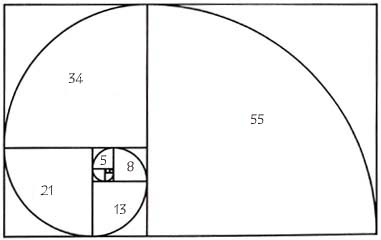
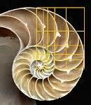

Continued: _Write a reverse function using only `cons`, `last`, `butlast` and `nil?`_

    (defn myreverse [s] (
      if (nil? s)
        nil
        (cons
          (last s)
          (myreverse (butlast s)))))

## Now the classic Fibonacci example...

There are dozens of approaches to recursion. Let's start simple. Write a function to get the _Nth_ element of the Fibonnacci sequence: `F(N) = F(N-1) + F(N-2)`

    (defn fib-nth [n]
      (if (< n ...?

 &nbsp; &nbsp;
 &nbsp; &nbsp;
 &nbsp; &nbsp;

[Next](session-3-2.md)
